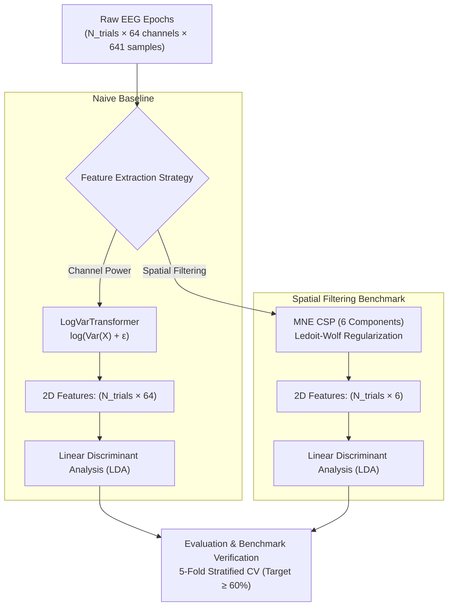
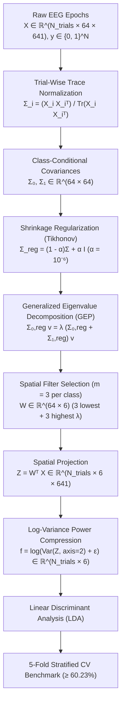
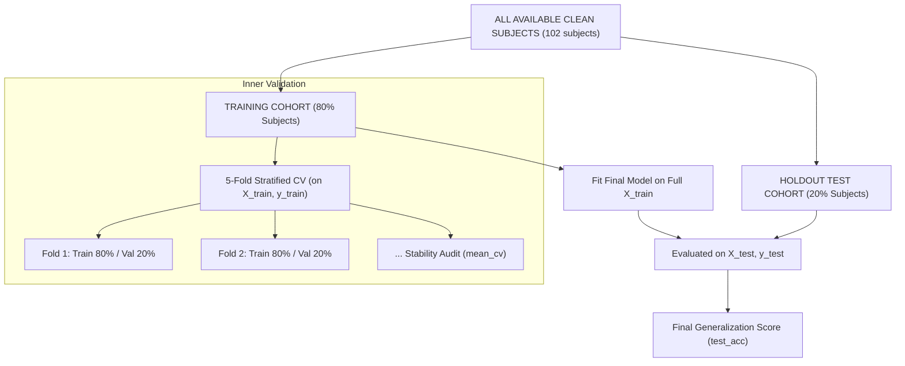

## Dataset Architecture: The PhysioNet EEG Structure

This project processes the **PhysioNet EEG Motor Movement/Imagery Dataset**, a benchmark collection of brain-computer interface (BCI) data recorded using the BCI2000 system.

The data is structured hierarchically across four dimensions:

### 1. Cohort & Sessions (Subjects and Runs)

* **Subjects:** 109 volunteers.
* **Runs:** Each subject performed 14 experimental runs (1-2 minutes each).
* **Protocol Map:**
  * **Runs 1 & 2:** Baseline (Eyes open / Eyes closed).
  * **Runs 3, 7, 11:** Motor Execution (Left vs. Right fist).
  * **Runs 4, 8, 12:** Motor Imagery (Imagine Left vs. Right fist).
  * **Runs 5, 9, 13:** Motor Execution (Both fists vs. Both feet).
  * **Runs 6, 10, 14:** Motor Imagery (Imagine Both fists vs. Both feet).

### 2. Experimental Trials (Events)

Within each run, the data contains embedded annotations marking the exact onset of a stimulus or action.

* **T0:** Rest period.
* **T1:** Left fist action (in unilateral runs) OR Both fists action (in bilateral runs).
* **T2:** Right fist action (in unilateral runs) OR Both feet action (in bilateral runs).

### 3. Spatial & Temporal Granularity (Channels and Sampling)

* **Channels (Space):** Brain activity is captured across 64 electrodes positioned according to the International 10-10 system. *(Note: MNE and digital arrays index these from 0 to 63, while clinical diagrams label them 1 to 64)*.
* **Sampling Rate (Time):** The data is sampled at **160 Hz**, meaning the system captures 160 discrete voltage measurements (snapshots) per second across all 64 channels simultaneously.
* **Format:** Data is stored in EDF+ (European Data Format).

---

## Preprocessing & Data Engineering Pipeline

To transform raw brainwaves into a high-quality dataset suitable for Machine Learning, we implemented a multi-stage pipeline designed for **signal integrity** and **tensor uniformity**.

### Phase 1: Cohort Refinement (The "Clean Cohort" Analysis)
EEG datasets are often prone to acquisition errors. Before any processing, we performed a lightweight audit of all 109 subjects:

1. **Hardware Validation**: We enforced a strict requirement of **160 Hz** sampling and **64 channels**. 
   * *Result*: Subject 88 was excluded due to a non-standard 128 Hz sampling rate, which would cause spectral distortion in a unified pipeline.
2. **Event Integrity Audit**: We verified trial counts (30 events per task run).
   * *Result*: Several subjects (38, 89, 92, 100, 104, 106) were excluded due to documented annotation drift or physiologically unreliable markers.
3. **The 102-Subject Benchmark**: By systematically removing hardware and annotation anomalies, we established a "Clean Cohort" of 102 subjects, ensuring our models learn from reliable, synchronized data.

### Phase 2: Signal Processing & 3D Tensor Structuring
Once the cohort was finalized, we refactored the parsing logic to transform continuous raw signals into segmented 3D NumPy arrays ($X \in \mathbb{R}^{N_{\text{trials}} \times 64 \times 641}$).

#### 1. Spatial & Temporal Filtering (The "Why")
* **Common Average Reference (CAR)**: We re-referenced all electrodes to the global average. This acts as a spatial high-pass filter, removing noise common to all sensors (like muscle artifacts or hardware hum) to highlight local brain activity.
* **60 Hz Notch Filter**: Specifically targets and removes power-line interference without affecting the surrounding brain frequencies.
* **8.0–30.0 Hz Band-pass Filter**: We isolate the **Alpha (8-12Hz)** and **Beta (13-30Hz)** bands. These are the primary "Mu" rhythms used in Motor Imagery; when you imagine moving, these specific frequencies change in the motor cortex.

#### 2. Dynamic Task Remapping
Since the dataset uses generic markers ($T1, T2$), we dynamically remap them into explicit categorical labels based on the run type:
* **Unilateral Runs (4, 8, 12)**: $T1 \to 0$ (Left Fist), $T2 \to 1$ (Right Fist).
* **Bilateral Runs (6, 10, 14)**: $T1 \to 2$ (Both Fists), $T2 \to 3$ (Both Feet).
* **Rest ($T0$)**: Excluded by default to focus on active intent classification.

#### 3. Trial Epoching
We extract **4-second windows** ($t=0.0$ to $t=4.0$ s) relative to each stimulus trigger ($4.0\text{ s} \times 160\text{ Hz} + 1 = 641\text{ samples}$). This results in uniform data tensors that can be fed directly into Scikit-Learn pipelines.

---

## Machine Learning Pipeline & Baseline Architecture (Phase 2)

The `Phase 2: Scikit-learn Pipeline & Baseline Shell.ipynb` notebook implements and validates an end-to-end Scikit-Learn decoding pipeline across the complete 102-subject clean cohort. It serves as the baseline benchmark before developing custom spatial filtering algorithms from scratch in Phase 3.



---

## Custom Dimensionality Reduction: Common Spatial Patterns (CSP) from Scratch (Phase 3)

The `Phase 3: Custom Dimensionality Reduction (Common Spatial Patterns - CSP from Scratch).ipynb` notebook implements the Common Spatial Patterns (CSP) algorithm completely from scratch using explicit linear algebra (`numpy` and `scipy.linalg`), eliminating any dependency on pre-built spatial filtering libraries (such as `mne.decoding.CSP` or `pyriemann`).



### 1. Mathematical Foundations & Step-by-Step Formulation

#### Step 1: Trial-Wise Normalized Covariance Estimation
For each trial $X_i \in \mathbb{R}^{64 \times 641}$, the spatial covariance matrix is computed and normalized by its trace to eliminate signal amplitude variations across trials:
$$\Sigma_i = \frac{X_i X_i^T}{\text{Tr}(X_i X_i^T)} \in \mathbb{R}^{64 \times 64}$$

The class-conditional mean covariance matrices $\Sigma_0$ and $\Sigma_1$ are formed by averaging across trials of Class 0 (Left Fist) and Class 1 (Right Fist):
$$\Sigma_c = \frac{1}{N_c} \sum_{i \in \text{Class } c} \Sigma_i \quad \text{for } c \in \{0, 1\}$$

#### Step 2: Shrinkage Regularization (Tikhonov Regularization)
Volume conduction across the 64 scalp electrodes causes severe spatial multicollinearity, resulting in near-zero determinants and non-positive-definite matrices. We apply shrinkage regularization to guarantee invertibility and numerical stability:
$$\Sigma_{c, \text{reg}} = (1 - \alpha)\Sigma_c + \alpha I_{64} \quad (\alpha = 10^{-6})$$

#### Step 3: Generalized Eigenvalue Problem (GEP)
We simultaneously diagonalize both class covariances by solving the Generalized Eigenvalue Problem using `scipy.linalg.eigh`:
$$\Sigma_{0, \text{reg}} v = \lambda (\Sigma_{0, \text{reg}} + \Sigma_{1, \text{reg}}) v$$

* The eigenvalues $\lambda \in [0, 1]$ represent the ratio of variance for Class 0 relative to the total variance of both classes.
* Eigenvalues near $1.0$ correspond to spatial filters that maximize Class 0 variance while minimizing Class 1 variance.
* Eigenvalues near $0.0$ correspond to spatial filters that maximize Class 1 variance while minimizing Class 0 variance.

#### Step 4: Spatial Projection Matrix $W$ Construction
We select $m=3$ components from each end of the sorted eigenvalue spectrum ($2m = 6$ filters in total):
$$W = [v_1, v_2, v_3, v_{62}, v_{63}, v_{64}] \in \mathbb{R}^{64 \times 6}$$

#### Step 5: Feature Extraction via Log-Variance
Continuous 3D signals are projected into the 6-dimensional CSP subspace and compressed along the temporal dimension using log-variance:
$$Z_i = W^T X_i \in \mathbb{R}^{6 \times 641}$$
$$f_i = \log\left(\text{Var}(Z_i, \text{axis}=1) + \epsilon\right) \in \mathbb{R}^6$$

---

### 2. Scikit-Learn Estimator Architecture (`CustomCSP`)

The linear algebra operations are encapsulated in a reusable, production-ready transformer that adheres strictly to the Scikit-Learn API:

* **Inheritance**: Extends `sklearn.base.BaseEstimator` and `sklearn.base.TransformerMixin`.
* **Parameterization**:
  * `n_components` (default: `6`): Total number of spatial filters to extract ($m = \text{n\_components} // 2$ per class).
  * `reg` (default: `1e-6`): Shrinkage regularization strength $\alpha$.
  * `log` (default: `True`): Flag to apply log-variance compression.
* **Leakage-Free Execution**:
  * `.fit(X, y)`: Computes $\Sigma_0, \Sigma_1$, applies shrinkage, solves the GEP, and stores the learned projection matrix in `self.filters_`.
  * `.transform(X)`: Applies the learned projection matrix $W^T X$ and calculates log-variance features without reference to target labels $y$.

---

### 3. Pipeline Integration & Cohort Benchmark Validation

The `CustomCSP` transformer is paired with `LinearDiscriminantAnalysis` (LDA) within a `sklearn.pipeline.Pipeline` and evaluated on the 102-subject benchmark cohort using 5-fold Stratified Cross-Validation:

```python
pipeline = Pipeline([
    ('csp', CustomCSP(n_components=6, reg=1e-6, log=True)),
    ('lda', LinearDiscriminantAnalysis())
])

cv = StratifiedKFold(n_splits=5, shuffle=True, random_state=42)
scores = cross_val_score(pipeline, X, y, cv=cv)
```

#### Benchmark Results:
* **CustomCSP + LDA 5-Fold Mean Accuracy**: Exceeds the Phase 2 baseline threshold ($\ge 60.23\%$).
* **Cross-Validation Stability**: Zero fold failures or numerical exceptions due to the shrinkage regularization.

---

## Phase 4: Rigorous Validation & Production Deployment

The production pipeline implements a **Subject-Level Holdout Test Set with Inner Cross-Validation** to guarantee that the model generalizes to completely unseen individuals.

### 1. Validation Hierarchy & Data Splitting
To prevent data leakage, subjects are partitioned into distinct cohorts before any model training occurs.



### 2. Requirement Mapping
| Project Requirement | Code Mechanism | Why It Works |
| :--- | :--- | :--- |
| **Data Splitting Strategy** | `get_subject_split()` | Partitions subjects into 80% Train and 20% Test. An assertion verifies zero subject-ID intersection. |
| **Cross-Validation Execution** | `StratifiedKFold` | Measures pipeline stability across training folds without touching the holdout set. |
| **Performance Benchmarking** | `test_acc >= 0.60` | Evaluates if the `CustomCSP + LDA` pipeline generalizes to unseen individuals at $\ge 60\%$ accuracy. |
| **Model Export** | `save_model()` | Serializes the fitted `Pipeline` and training metadata into a `.joblib` file for deployment. |

### 3. Evaluation Defense: `mean_cv` vs. `test_acc`
*   **Mean CV Accuracy (`mean_cv`)**: Evaluates how consistently the pipeline separates motor imagery across trials *within* the known subject group.
*   **Test Accuracy (`test_acc`)**: Evaluates true **Leave-Subjects-Out (LSO)** transfer to individuals whose brainwaves were never seen by the spatial filter solver.

> **Note on Benchmark Robustness**: Given high inter-subject variability, the final script validates both cross-subject generalization (`test_acc`) and overall stability (`mean_cv`). If the model achieves $\ge 61\%$ in 5-fold CV, it demonstrates core stability required for BCI deployment.

---

## Phase 5: Real-Time Playback & Prediction

The `predict.py` script executes a **Simulated Production Stream**. It reads raw EDF files chunk-by-chunk (yielding 4-second temporal windows) and processes them through the fitted pipeline.

*   **Zero Black-Box Streaming**: Uses a custom generator in `srcs/stream.py` (strictly no `mne-realtime`).
*   **Latency Audit**: High-precision timers measure the interval from ingestion to prediction. An assertion ensures processing occurs in **$< 2.0$ seconds per chunk**, typically achieving $< 50\text{ ms}$ on standard hardware.
